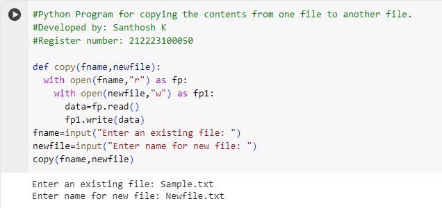

# copy-file
## AIM:
To write a python program for copying the contents from one file to another file.
## EQUIPEMENT'S REQUIRED: 
PC
Anaconda - Python 3.7
## ALGORITHM: 
### Step 1:
The script prompts the user to enter the name of an existing file using the input function, and the entered value is assigned to the variable fname.

### Step 2:
The script then prompts the user to enter a name for a new file using the input function, and the entered value is assigned to the variable newfile.

### Step 3:
The copy function is called with the provided file names (fname and newfile).

### Step 4:
Inside the copy function, it opens the existing file (fname) in read mode ('r') using a with statement and assigns the file object to fp.

### Step 5:
Within the nested with statement, it opens the new file (newfile) in write mode ('w') using another with statement and assigns the file object to fp1.

### Step 6:
The content of the existing file (fname) is read using the read method, and the obtained data is written to the new file (newfile) using the write method on the file object fp1 

## PROGRAM:
```
#Python Program for copying the contents from one file to another file
#Developed by: Santhosh K
#Register number: 212223100050 

def copy(fname,newfile):
  with open(fname,"r") as fp:
    with open(newfile,"w") as fp1:
      data=fp.read()
      fp1.write(data)
fname=input("Enter an existing file: ")
newfile=input("Enter a name for new file: ")
```
### OUTPUT:


## RESULT:
Thus the program is written to copy the contents from one file to another file.